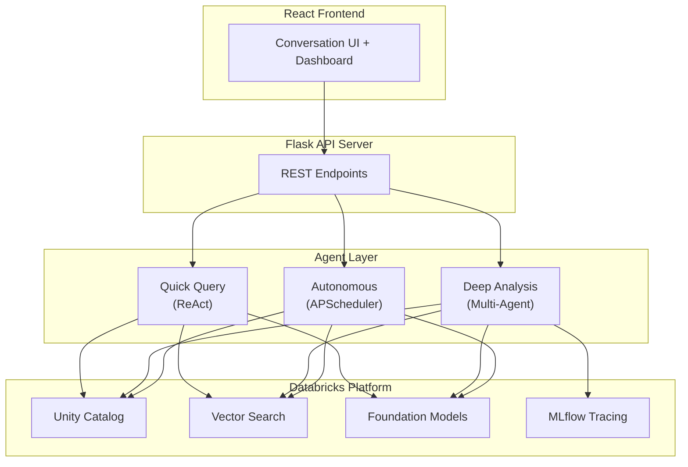
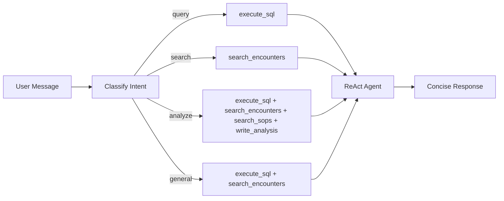
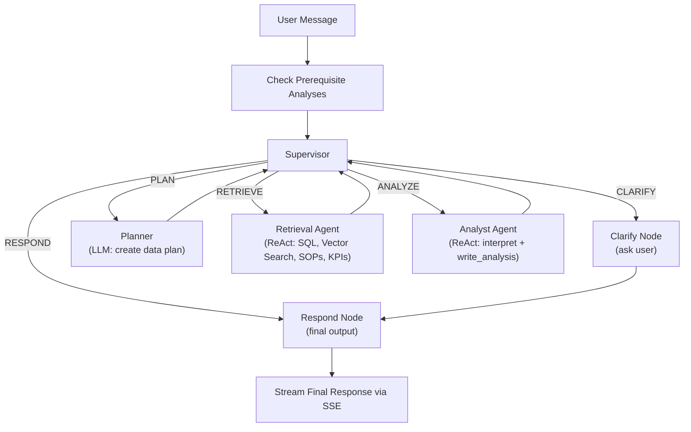
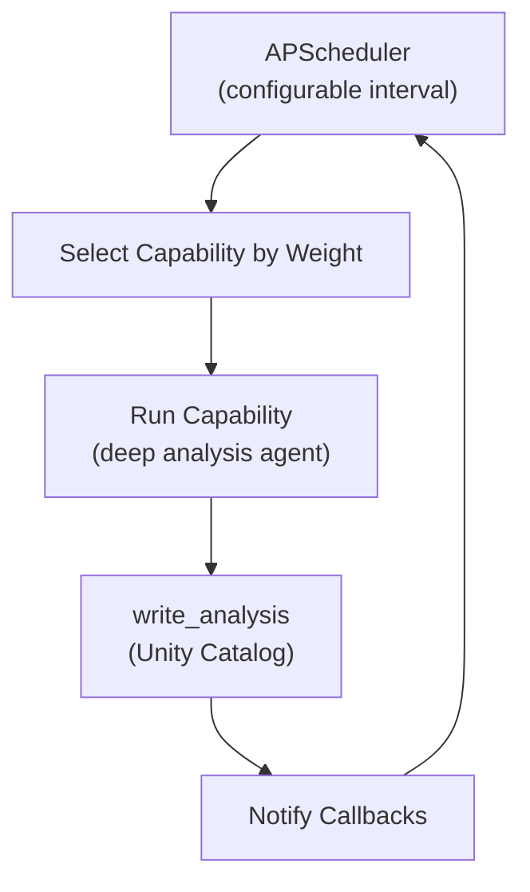

# Hospital Control Tower

AI-powered operations intelligence for hospital logistics on Databricks.

> **Disclaimer**: This is a Databricks Solution Accelerator -- a starting point to accelerate your project. Hospital Control Tower is fully functioning end-to-end, but you should evaluate, test, and modify this code for your specific use case. Agent recommendations and analytics will vary depending on your data and configuration.

## What This Is

A deployable Databricks App that gives hospital operations teams a conversational AI companion. Ask questions about encounters, drug costs, ED wait times, and staffing -- the agent queries your data, searches Standard Operating Procedures, and recommends actions grounded in your SOPs.

The app shows:
- A **real-time dashboard** with composite health score, encounter trends, alerts, and operational metrics
- A **chat interface** with two modes: Quick Query (2-5s lookups) and Deep Analysis (30-90s multi-agent investigations)
- **Autonomous monitoring** that detects health issues and generates recommended action reports in the background

**Example questions the agent can answer:**
- Why did drug costs spike in November for Hospital A?
- What specific actions can I take to reduce LOS in Hospital A?
- Why is LOS higher for patients discharged on Mondays?
- How can I reduce wait times in the Emergency Department?
- How can I lower the use of contract labor in the cardiology department?

## Quickstart

### Option 1: One-Command Setup (Recommended)

This project is a pure [Databricks Asset Bundle](https://docs.databricks.com/dev-tools/bundles/). All
config comes from `variables.yml` (committed, no workspace values) plus your local
`.databricks-env.sh` (gitignored). No files are generated at deploy time.

1. **Configure your local values** (once):

   ```bash
   cp .databricks-env.sh.example .databricks-env.sh
   # edit .databricks-env.sh — set your CLI profile + catalog / warehouse / VS endpoint
   ```

   `.databricks-env.sh` is gitignored, so your workspace-specific values never get committed.
   The workspace **host comes from your CLI profile** (`DATABRICKS_CONFIG_PROFILE`) — it is not
   stored in any tracked file.

2. **Run setup** (first-time provisioning):
   ```bash
   source .databricks-env.sh
   ./setup.sh dev                    # deploy + data + data model + vector search + grants + diagnostics
   ```

   Useful flags:
   ```bash
   ./setup.sh dev --skip-data        # skip the (slow) data generation job
   ./setup.sh dev --skip-to-app      # only (re)deploy + run the app, skip setup jobs
   ```

3. **Routine redeploys** (after setup — no script needed):
   ```bash
   source .databricks-env.sh
   databricks bundle deploy -t dev
   databricks bundle run hospital_ops_app -t dev
   ```

4. **Access**: Open your Databricks workspace > **Apps** > `dev-hospital-control-tower`.

### Option 2: Git Folder (No CLI)

1. Clone this repository into a Databricks Git Folder
2. Run notebooks in order: `00_generate_data.py` -> `01_setup_lakebase.py` -> `06_simplify_data_model.py` -> `02_setup_vector_search.py` -> `05_setup_sop_vector_search.py`
3. Deploy the app from the Databricks Apps UI, pointing to `app/`. Set the app's environment
   variables (CATALOG, SCHEMA, DATABRICKS_WAREHOUSE_ID, VECTOR_SEARCH_ENDPOINT, the `LLM_MODEL_*`
   values, and `MLFLOW_EXPERIMENT`) in the Apps UI — the same names used in `resources/apps.yml`.
4. Run `03_grant_permissions.py` to grant the app's service principal access to your data

## Prerequisites

| Tool | Minimum Version | Purpose |
|------|----------------|---------|
| [Databricks CLI](https://docs.databricks.com/dev-tools/cli/install.html) | >= 0.240.0 | Bundle deployment and job management |
| Python | >= 3.10 | Backend and notebooks |

You also need:
- A **Databricks workspace** with Unity Catalog enabled
- A **SQL Warehouse** -- set the ID in `variables.yml` (`warehouse_id`)
- A **Vector Search endpoint** -- created automatically by `02_setup_vector_search.py`, or provide an existing one in `variables.yml`
- (Optional) A **Lakebase instance** for transactional storage -- see [`docs/LAKEBASE_SETUP.md`](docs/LAKEBASE_SETUP.md)

## SOP grounding

The "Next Best Action" recommendations are grounded in Standard Operating Procedures via the
`sop_vector_index`. This works **out of the box** — `05_setup_sop_vector_search.py` ingests the
sample SOPs committed under `data/sop_samples/` (discharge planning, ED throughput, drug cost
management), so a clean deploy produces grounded recommendations with no manual upload.

To ground on **your own** SOP documents instead, create a `sop_pdfs` table of binary PDFs before
running the notebook — it detects the table and parses those PDFs with `ai_parse_document`
instead of the samples:

```sql
CREATE TABLE IF NOT EXISTS <catalog>.<schema>.sop_pdfs AS
SELECT path, content
FROM read_files('/Volumes/<catalog>/<schema>/hospital_sop_documents/*.pdf', format => 'binaryFile');
```

Then re-run `05_setup_sop_vector_search.py` (or `databricks bundle run setup_sop_vector_search -t dev`).

## Architecture

<details>
<summary>Architecture diagram</summary>


</details>

## Agent Modes

### Quick Query
Fast ReAct agent with intent classification. Classifies your question (data lookup, search, analysis) and selects the right tools. Responds in 2-5 seconds.

<details>
<summary>Architecture diagram</summary>


</details>

### Deep Analysis
Multi-agent LangGraph graph with LLM supervisor. Streams progress via SSE. The supervisor routes between planning, retrieval, analysis, and clarification nodes. Responds in 30-90 seconds with structured reports, evidence citations, and SOP-grounded recommendations.

<details>
<summary>Architecture diagram</summary>


</details>

### Autonomous Mode
Background agent (APScheduler) that monitors operational health and generates recommended action reports only when issues are detected. Configurable interval, auto-stops after 2 hours.

<details>
<summary>Architecture diagram</summary>


</details>

## Data Model

5 core tables + 1 derived view, all generated synthetically with built-in patterns for the agent to discover:

```
dim_encounters (patient encounter metadata)
    |
    +-- fact_drug_costs (drug/pharmacy costs per encounter)
    |
    +-- fact_staffing (staffing levels by type: full_time, contract, per_diem)
    |
    +-- fact_ed_wait_times (ED wait time events by acuity)
    |
    +-- fact_operational_kpis (daily KPIs per hospital/department)

hospital_overview (VIEW - derived from dim_encounters)
```

**Health Score**: Composite 0-100 score from: 40% avg LOS (target <5d) + 30% readmission rate (target <10%) + 30% ED breaches.

## Notebooks

| Notebook | Description |
|----------|-------------|
| `00_generate_data.py` | Generate synthetic hospital data (encounters, drug costs, staffing, ED waits, KPIs). Supports `overwrite` and `append` modes. |
| `01_setup_lakebase.py` | Create schema and `analysis_outputs` table |
| `02_setup_vector_search.py` | Create Vector Search endpoint and encounter similarity index |
| `03_grant_permissions.py` | Grant Unity Catalog permissions to the app service principal |
| `04_diagnostic_check.py` | Validate all prerequisites (tables, indexes, endpoints, permissions) |
| `05_setup_sop_vector_search.py` | Build the SOP vector index. Uses the bundled `data/sop_samples/*.txt` files by default; parses a `sop_pdfs` table instead if one exists (see [SOP grounding](#sop-grounding)) |
| `06_simplify_data_model.py` | Setup and refresh the data model tables and views |
| `07_generate_batches.py` | Generate incremental data batches for testing |
| `08_setup_lakebase_migrations.py` | Run Alembic migrations for Lakebase schema |

## Configuration

The app's environment variables are declared in `resources/apps.yml` under the app's
`config.env` block, resolved from `variables.yml` (and your `.databricks-env.sh` overrides) at
deploy time. There is no generated `app.yaml`.

| Variable | Description | Default |
|----------|-------------|---------|
| `CATALOG` | Unity Catalog name | -- (set in `.databricks-env.sh`) |
| `SCHEMA` | Schema containing tables | `med_logistics_nba` |
| `DATABRICKS_WAREHOUSE_ID` | SQL Warehouse ID | -- (set in `.databricks-env.sh`) |
| `VECTOR_SEARCH_ENDPOINT` | Vector Search endpoint name | -- (set in `.databricks-env.sh`) |
| `LLM_MODEL_ORCHESTRATOR` | Foundation model for fast routing / supervisor | `databricks-gpt-oss-120b` |
| `LLM_MODEL_RAG` | Foundation model for deep analysis / RAG | `databricks-claude-sonnet-4-5` |
| `MLFLOW_EXPERIMENT` | MLflow experiment path for agent traces | `/Shared/hospital-control-tower-agent` |
| `SEED_ON_STARTUP` | Seed/refresh demo data on app boot | `true` |
| `AUTONOMOUS_INTERVAL_SECONDS` | How often autonomous mode checks (seconds) | `3600` |
| `AUTO_START_AUTONOMOUS` | Start autonomous mode on app boot | `false` |

## Project Structure

```
hospital-control-tower-agentic-nba/
  setup.sh                    # First-time provisioning (deploy + jobs); routine redeploys use `databricks bundle deploy`
  databricks.yml              # Bundle definition (committed; no workspace values, no host)
  variables.yml               # Bundle variables (committed; generic defaults only — no workspace values)
  .databricks-env.sh.example  # Template for your local, gitignored env (profile + BUNDLE_VAR_* overrides)
  resources/apps.yml          # App resource: command + env (config source of truth) + grants
  app/                        # Databricks App (Flask + React)
    api_server.py             #   Flask API server with REST + SSE endpoints
    agent/                    #   Agent implementations
      config.py               #     Centralized configuration (env vars, table names, constants)
      orchestrator.py         #     Quick Query mode (ReAct with intent classification)
      graph.py                #     Deep Analysis mode (multi-agent LangGraph StateGraph)
      autonomous.py           #     Autonomous mode (APScheduler + smart health check)
      tools.py                #     Shared agent tools (SQL, vector search, SOP, KPI)
    src/                      #   React frontend (Vite + Tailwind)
      App.jsx                 #     Main app component
      components/             #     UI components (Header, Chat, Dashboard, DemoGuide, Settings)
  src/                        # Shared Python source (mirrored for notebooks)
    agent/                    #   Agent code (graph, orchestrator, tools)
  notebooks/                  # Databricks notebooks (see table above)
  resources/                  # DAB resource definitions (jobs.yml, apps.yml)
  data/                       # Sample data
    sop_samples/              #   Sample SOP documents for vector search
  docs/                       # Documentation
```

## Documentation

| Document | Description |
|----------|-------------|
| [`docs/BUILDING_AGENTS.md`](docs/BUILDING_AGENTS.md) | Developer guide: how the agent architecture works and how to extend it |
| [`docs/WALKTHROUGH.md`](docs/WALKTHROUGH.md) | 15-minute demo walkthrough script for presenters |
| [`docs/GAP_ANALYSIS.md`](docs/GAP_ANALYSIS.md) | Business value proposition and competitive landscape |
| [`docs/QUICK_REFERENCE.md`](docs/QUICK_REFERENCE.md) | One-page demo cheat sheet |
| [`docs/LAKEBASE_SETUP.md`](docs/LAKEBASE_SETUP.md) | Optional Lakebase configuration guide |

## Libraries

### Python Backend

| Library | Version | License | Description | PyPI |
|---------|---------|---------|-------------|------|
| flask | >= 3.0.0 | BSD-3-Clause | Lightweight WSGI web framework | [PyPI](https://pypi.org/project/Flask/) |
| flask-cors | >= 4.0.0 | MIT | Cross-Origin Resource Sharing for Flask | [PyPI](https://pypi.org/project/Flask-Cors/) |
| databricks-sdk | >= 0.20.0 | Apache 2.0 | Databricks SDK for Python | [PyPI](https://pypi.org/project/databricks-sdk/) |
| databricks-langchain | >= 0.1.0 | MIT | LangChain integration for Databricks | [PyPI](https://pypi.org/project/databricks-langchain/) |
| databricks-vectorsearch | >= 0.40 | Apache 2.0 | Databricks Vector Search client | [PyPI](https://pypi.org/project/databricks-vectorsearch/) |
| langgraph | >= 0.2.0 | MIT | Multi-agent orchestration framework | [PyPI](https://pypi.org/project/langgraph/) |
| langchain-core | >= 0.3.0 | MIT | Core LangChain abstractions | [PyPI](https://pypi.org/project/langchain-core/) |
| gunicorn | >= 21.2.0 | MIT | Python WSGI HTTP server | [PyPI](https://pypi.org/project/gunicorn/) |
| httpx | >= 0.25.0 | BSD-3-Clause | Async HTTP client | [PyPI](https://pypi.org/project/httpx/) |
| apscheduler | >= 3.10.0 | MIT | Advanced Python Scheduler | [PyPI](https://pypi.org/project/APScheduler/) |
| sqlalchemy | >= 2.0.0 | MIT | SQL toolkit and ORM | [PyPI](https://pypi.org/project/SQLAlchemy/) |
| alembic | >= 1.13.0 | MIT | Database migration tool for SQLAlchemy | [PyPI](https://pypi.org/project/alembic/) |
| psycopg2-binary | >= 2.9.0 | LGPL-3.0 | PostgreSQL adapter for Python | [PyPI](https://pypi.org/project/psycopg2-binary/) |
| mlflow | >= 3.1 | Apache 2.0 | ML lifecycle management and tracing | [PyPI](https://pypi.org/project/mlflow/) |

### Frontend

| Library | Version | License | Description | npm |
|---------|---------|---------|-------------|-----|
| react | ^18.3.1 | MIT | UI component library | [npm](https://www.npmjs.com/package/react) |
| react-dom | ^18.3.1 | MIT | React DOM renderer | [npm](https://www.npmjs.com/package/react-dom) |
| react-markdown | ^9.0.1 | MIT | Markdown renderer for React | [npm](https://www.npmjs.com/package/react-markdown) |
| tailwindcss | ^3.4.1 | MIT | Utility-first CSS framework | [npm](https://www.npmjs.com/package/tailwindcss) |
| vite | ^5.4.0 | MIT | Frontend build tool | [npm](https://www.npmjs.com/package/vite) |

### Runtime (provided by Databricks)

| Library | License | Description |
|---------|---------|-------------|
| pyspark | Apache 2.0 | Apache Spark Python API |
| dbldatagen | Apache 2.0 | Databricks Labs synthetic data generator |
| faker | MIT | Fake data generation library |

### Foundation Models

| Model | Provider | Usage |
|-------|----------|-------|
| databricks-gpt-oss-120b | Databricks | Quick query orchestrator (default) |
| databricks-claude-sonnet-4-5 | Anthropic (via Databricks) | Deep analysis, RAG, autonomous agent |
| databricks-gte-large-en | Databricks | Vector Search embeddings |

All application dependencies use permissive open-source licenses (MIT, Apache 2.0, BSD-3-Clause) except `psycopg2-binary` (LGPL-3.0, optional -- only used with Lakebase).

## License

[DB License](LICENSE.md)
